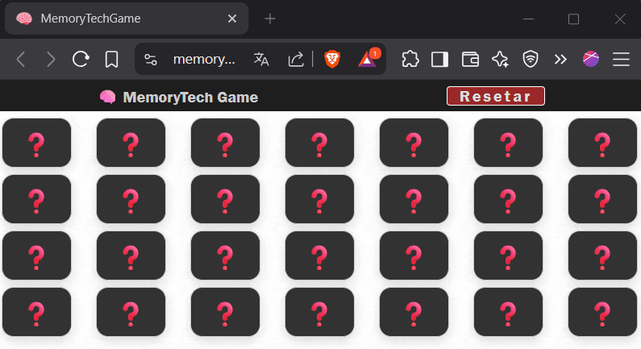

# Memory Tech Game - README

## 🔗 Link do game:

https://memory-tech-game.vercel.app/

---

## 👋 Boas-vindas

Olá! Bem-vindo(a) ao **Memory Tech Game**, meu primeiro projeto pessoal. Está precisando espairecer ou distrair a mente por alguns minutos?  
Este game usa **emojis de tecnologia** de forma divertida. Ao jogar, tente interpretar o que cada emoji representa no mundo Tech.

---

## 🎯 Objetivo, Tecnologias e Ferramentas

O objetivo do projeto é simular uma rotina próxima do ambiente corporativo, praticando:

- Versionamento de código com **Git/GitHub**
- Testes com **Vitest**
- Uso de JavaScript para toda a lógica de controle
- Componentização em **React**
- Documentação com arquivos `README.md` e auxiliares
- Organização e entregas com sprints ao estilo **Scrum**
- Refatorações constantes para aprendizado de novas tecnologias

---

## ⚙️ Funcionalidades

- **Sistema de embaralhamento de cartas**  
  A cada reinício, os emojis são aleatoriamente reorganizados, garantindo partidas únicas.

- **Componente 'Carta' como Dumb Component**  
  O componente é apenas visual e sem lógica interna, recebendo props e emitindo eventos. Isso facilita testes e reutilização.

- **Controle de cliques simultâneos**  
  Evita que o jogador clique em mais de duas cartas ao mesmo tempo com um `state` de bloqueio temporário.

- **Verificação automática de pares**  
  A lógica compara as cartas e mantém pares certos abertos ou esconde novamente se forem diferentes.

- **Reinício do jogo com novo embaralhamento**  
  Um botão de "Reiniciar" reseta o jogo, embaralha novamente as cartas e limpa o estado atual.

- **Responsividade mobile implementada**  
  Layout adaptado para diferentes tamanhos de tela, garantindo boa experiência em smartphones e tablets.

- **Testes de unidade com Vitest**  
  Foram criados testes para:
  - `Carta.jsx`: renderização e comportamento.
  - `Mesa.jsx`: fluxo completo de jogo (cliques, pares, bloqueios).
  - `gerarBaralho.js`: integridade dos pares e embaralhamento.

---

## 🧩 Próximos passos / Melhorias planejadas

#### Melhorias de UX
- Adição de **timer** e **contador de jogadas**
- Modo inicio com cartas abertas por um tempo para memorização
- **Modo Player 1 vs Player 2**
- **Escolha de tema** ou nível de dificuldade
- Modo com **limite de tempo ou tentativas**
- Incrementar **acessibilidade** (`aria-label`, navegação por teclado)
- Implementação do **modal de vitória**

#### Melhorias de UI, Escalabilidade e Manutenção
- Separar melhor as responsabilidades do componente Mesa até conseguir se enquadrar no Princípio da Responsabilidade Única SRP
- Usar algum padrão para interface como shadcn/ui

---
